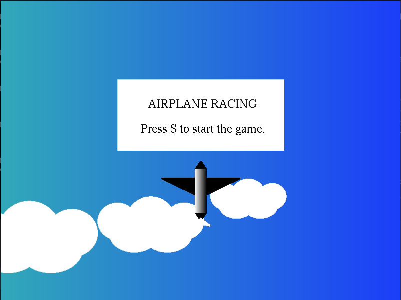
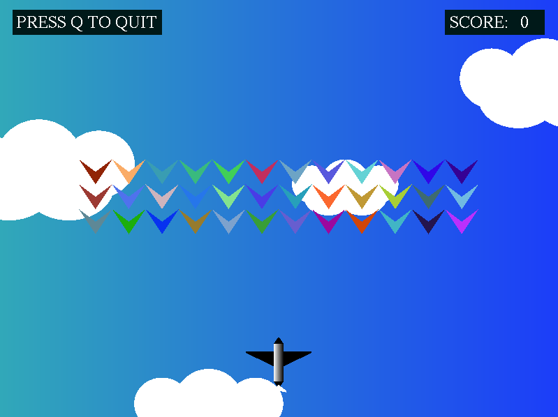
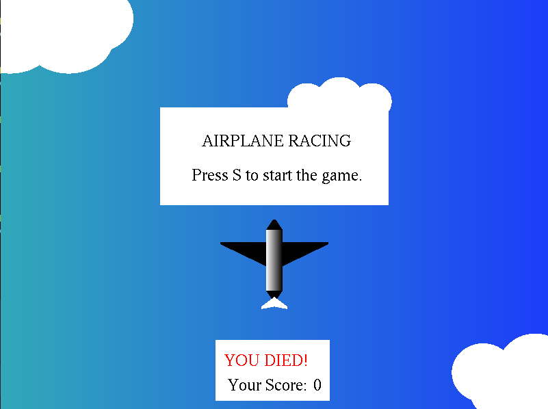

## Airplane Shooting Game

### Computer Graphics Lab Project using C++ and OPENGL

To win player needs to score 15 before the enemy moves close to the player.

### How to play?

- Press capital or small s to start the game
- Press capital or small q to quit while playing
- Press top arrow key to shoot
- Press left/right arrow key to move the plane left or right

To run locally,

```bash
git clone https://github.com/amitkbiswas0/fly-plane.git
cd fly-plane
g++ main.cpp -o main -lGL -lGLU -lglut -lm && ./main
```

Screenshots ,



